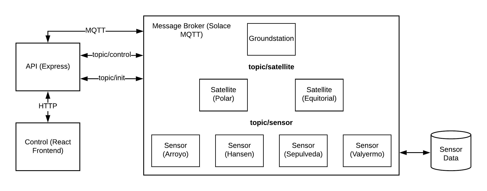

## Schema

This is basic documentation specifying the component communication in greater depth than the `README.md` goes into.

### System Architecture

The structure of this sounds complicated at first because implementation of tools like Docker, Nginx, Flask, Solace, etc. but is relatively straight forward in terms of core functionality. Provided below is a rough diagram showing the communication between components.



There are four primary components in the system as pictured above. The data is being ignored as a component because it is built into the current sensor component. All components are in communication through MQTT with Solace as the broker. I'll go through each of the components and their behavior and composition.

#### Control

This acts as a user interface for the simulation and simply sends messages via MQTT over `topic/control` to the rest of the components within the system. This also listens to messages on any topic of the format `topic/*` and provides a log of them which can be accessed on the UI.

The UI through ported to a Flask server and then a reverse proxy with Nginx which allows for the user interface on http://localhost:5000 to interact with the entire system.

#### Sensor

This is a relatively simple model of a ground sensor which takes the input of which dataset to operate off of from the four options provided below. There is only one model for sensors and it is just reused varying the dataset and location. The particularly model uses streamflow data from the USGS website in the form of a CSV. It outputs its data out according to the simulation speed as specified by the control.

#### Satellite

This component models simple orbits of a satellite listening to data from the sensors. It does a very basic calculation to detect whether the latitude/longitude of the sensor is within range of the satellite and relays the data to the groundstations if so. The satellite propogates according to initial position and the choice of either a polar or equitorial orbit. The speed of the propagation is determined by the simulation speed received from control.

#### Groundstation

This is the simplest component in the system and just listens to satellites regardless of location. It relays any received data over `topic/groundstation` to be reflected in the simulation logs.

### Schema

The schema for communication between the components is loosely based off the SensorThings API which can be read more about here: https://en.wikipedia.org/wiki/SensorThings_API. There are four types of communications and i'll go through each of the ones i'm currently using. These are not final and i'm very open to suggestions. The general schema will consist of the fields `name, description, and properties` which are the basic attributes of any "thing" within our system.

#### Control

##### Example Data:

```json
{
    "name" : "control",
    "description" : "Starts and stops the simulation. Logs all communications over 'topic/*'.",
    "properties" : {
        "type" : "start",
        "simSpeed": 2
    }
}
```

This example is for the start message and to stop the system, a similar message with the `type: "stop"` and no `simSpeed` field will stop the system.

#### Sensor

##### Example Data:

```json
{
    "name": "sensor_8278",
    "description" : "Model simulating streamflow data for a USGS sensor in Arroyo, California.",
    "observation_type" : "Streamflow",
    "unit_of_measurement" : "ft^3/s",
    "result_time" : "2019-05-30",
    "properties" : {
        "observation" : "4.37",
        "qualification" : "A",
    },
    "location": {
        "latitude": 0,
        "longitude": 80
    }
}
```

This is pulling the observation from the datasets CSV files row by row. Some important fields are the `observation_type, unit_of_measurement, result_time, and properties.qualification` which specify the context of the observation similar to the sensor model on the SensorThings API.

#### Satellite

##### Example Data:

```json
{
    "name" : "satellite_polar",
    "description" : "Model simulating satellite in polar orbit.",
    "properties" : {
        "relayed_observation" : "4.37",
        "observation_origin" : "sensor_8278"
    },
    "location": {
        "latitude": 0,
        "longitude": 80
    }
}
```

This is a pretty simple one as it just outputs location and info regarding a relayed communication from `topic/sensor`.

#### Groundstation

##### Example Data:

```json
{
    "name" : "groundstation",
    "description" : "Model simulating groundstation connected to all satellites.",
    "properties" : {
        "relayed_observation" : "4.37",
        "observation_origin" : "sensor_8278",
        "message_source" : "satellite_polar"
    }
}
```

This is simple as well as it just relays an observation providing context.


